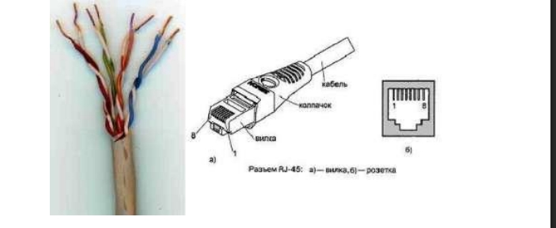
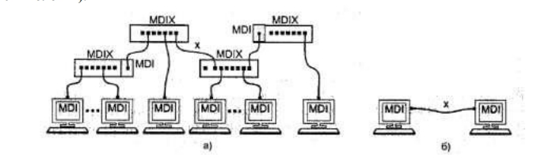
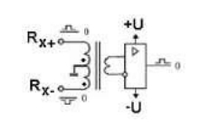
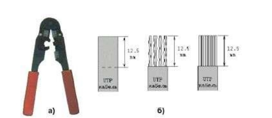

## Лабораторная работа №1
## Подключение персонального компьютера к локальной вычислительной сети

---

**Министерство образования и науки РФ**

**Кафедра «Сети и телекоммуникации»**

---

| | |
|:--|:--|
| **Студент** | Дударева Дарья |
| **Группа** | Ипо8482 |
| **Преподаватель** | `[ФИО преподавателя]` |
| **Дата выполнения** | `[__].___.20__` |
| **Оценка** | `[_____]` |

---

## 1. Оборудование и материалы

| № | Компонент | Модель / Характеристики |
|:--|:----------|:------------------------|
| 1 | Персональный компьютер | `[Модель ПК]` |
| 2 | Сетевая карта (NIC) | `[Модель]`, шина `[PCI/PCIe]` |
| 3 | Кабель | UTP `[Cat 5/5e/6]`, жил: `[4/8]` |
| 4 | Коннекторы RJ-45 | 8P8C, `[__]` штук |
| 5 | Обжимной инструмент | `[Модель щипцов]` |
| 6 | Тестер кабеля | `[Модель тестера]` |
| 7 | Ноутбук/ПК для тестирования | `[Модель]` |

---

## 2. Теоретическая часть

### 2.1. Кабель UTP и разъем RJ-45

*Рис. 1 – Кабель UTP категории 5 (слева) и разъем RJ-45 (вилка и розетка)*

### 2.2. Топология Ethernet

*Рис. 2 – Сеть 10BaseT/100BaseTX: а) звезда, б) соединение двух ПК напрямую*

### 2.3. Схемы обжима кабеля

| Прямой кабель (Straight) | Перекрестный кабель (Crossover) |
|:------------------------:|:-------------------------------:|
|  |  |

*Рис. 3 – Прямой (а) и перекрестный (б) кабели Ethernet*

### 2.4. Гальваническая развязка

*Рис. 4 – Гальваническая развязка сетевых адаптеров*

### 2.5. Обжимной инструмент

*Рис. 5 – Обжимной инструмент (а) и снятие оболочки (б)*

### 2.6. Схемы заделки T568A и T568B

| T568A | T568B |
|:-----:|:-----:|
|  |  |

*Рис. 6 – Стандарты обжима T568A и T568B*

### 2.7. Порядок обжима вилки

*Рис. 7 – Порядок обжима вилки RJ-45*

### 2.8. Монтаж 4-жильного кабеля

*Рис. 8 – Варианты монтажа 4-жильного кабеля*

### 2.9. Сетевая карта PCI

*Рис. 9 – Сетевая карта: 1 — RJ-45, 2 — LED, 3 — шина PCI, 4 — BootROM, 5 — контроллер, 6 — Remote Wake Up*

---

## 3. Задание

### 3.1. Тип выполняемой работы

| Вариант | Соединение | Тип кабеля | Отметка |
|:-------:|:-----------|:-----------|:-------:|
| А | ПК ↔ Коммутатор / Концентратор | Прямой (Straight) | `[ ]` |
| Б | ПК ↔ ПК | Перекрестный (Cross-over) | `[ ]` |

### 3.2. Параметры смонтированного кабеля

| Параметр | Значение |
|:---------|:---------|
| Тип обжима | `[Прямой / Перекрестный]` |
| Стандарт заделки | T568`[A / B]` |
| Длина кабеля | `[_____]` см |
| Скорость передачи | `[10 / 100 / 1000]` Мбит/с |
| Количество использованных пар | `[2 / 4]` |

---

## 4. Распиновка RJ-45

> ⚠️ **Внимание:** Укажите фактический порядок цветов жил на обоих концах кабеля

### 4.1. Конец №1 (сторона ПК)

| Pin | Цвет жилы | Pin | Цвет жилы |
|:---:|:----------|:---:|:----------|
| 1 | `[__________]` | 5 | `[__________]` |
| 2 | `[__________]` | 6 | `[__________]` |
| 3 | `[__________]` | 7 | `[__________]` |
| 4 | `[__________]` | 8 | `[__________]` |

### 4.2. Конец №2 (сторона устройства / второго ПК)

| Pin | Цвет жилы | Pin | Цвет жилы |
|:---:|:----------|:---:|:----------|
| 1 | `[__________]` | 5 | `[__________]` |
| 2 | `[__________]` | 6 | `[__________]` |
| 3 | `[__________]` | 7 | `[__________]` |
| 4 | `[__________]` | 8 | `[__________]` |

### 4.3. Соответствие схеме

| Параметр | Результат |
|:---------|:----------|
| Соответствует ли обжим выбранному типу | `[Да / Нет]` |
| Совпадает ли с T568`[A/B]` на обоих концах | `[Да / Нет]` |

---

## 5. Сетевой адаптер

### 5.1. Характеристики сетевой карты

> Данные получены командой `ipconfig /all` и из Диспетчера устройств

| Параметр | Значение |
|:---------|:---------|
| Модель адаптера | `[Название из диспетчера устройств]` |
| MAC-адрес (физический) | `[XX-XX-XX-XX-XX-XX]` |
| Производитель (по MAC) | `[Realtek / Intel / Qualcomm / ...]` |
| Адрес ввода-вывода (I/O) | `[0x______]` (если доступно) |
| Номер прерывания (IRQ) | `[______]` (если доступно) |
| Поддерживаемые скорости | `[10/100/1000]` Мбит/с |
| Поддержка Auto-MDIX | `[Да / Нет / Неизвестно]` |

### 5.2. Состояние адаптера

| Параметр | Значение |
|:---------|:---------|
| Текущая скорость | `[__]` Мбит/с |
| Режим дуплекса | `[Half / Full / Auto]` |
| Состояние | `[Включен / Отключен]` |

---

## 6. Проверка связи

### 6.1. Команда ipconfig /all

cmd
C:\Users\Kozlov> ipconfig /all

Настройка протокола IP для Windows

   Имя компьютера . . . . . . . . : [_________________________]
   Основной DNS-суффикс . . . . . : [_________________________]
   Тип узла . . . . . . . . . . . : [_________________________]
   IP-маршрутизация включена . . . : [_________________________]

Адаптер Ethernet: Подключение по локальной сети

   DNS-суффикс этого подключения . : [_________________________]
   Описание. . . . . . . . . . . . : [_________________________]
   Физический адрес . . . . . . . : [_________________________]
   DHCP включен . . . . . . . . . : [_________________________]
   IPv4-адрес . . . . . . . . . . : [_________________________]
   Маска подсети . . . . . . . . . : [_________________________]
   Основной шлюз . . . . . . . . . : [_________________________]
   DNS-серверы . . . . . . . . . . : [_________________________]

   ### 7. Результаты тестирования кабеля

| Индикатор тестера | Статус | Примечание |
| :---: | :---: | :--- |
| 1 | `[✅ / ❌]` | `[Если есть замыкание/обрыв]` |
| 2 | `[✅ / ❌]` | |
| 3 | `[✅ / ❌]` | |
| 4 | `[✅ / ❌]` | |
| 5 | `[✅ / ❌]` | |
| 6 | `[✅ / ❌]` | |
| 7 | `[✅ / ❌]` | |
| 8 | `[✅ / ❌]` | |

---

## 8 Фотоотчет выполнения работы

### 8.1 Зачистка кабеля

*Фото 1 - Зачистка внешней оболочки кабеля на 12.5 мм*

### 8.2 Расположение жил

*Фото 2 - Расположение жил в соответствии со схемой заделки*

### 8.3 Установка жил в коннектор

*Фото 3 - Установка жил в разъем RJ-45 до упора*

### 8.4 Обжим разъема

*Фото 4 - Обжим разъема RJ-45 специальным инструментом*

### 8.5 Готовый кабель

*Фото 5 - Готовый обжатый кабель с двух сторон*

### 8.6 Тестирование

*Фото 6 - Проверка кабеля тестером*

### 8.7 Результаты ping

*Скриншот 1 - Результат проверки связи командой ping*

---

## 9 Контрольные вопросы (Самопроверка)

🔹 Нажмите, чтобы раскрыть вопросы для ответов

1. **Какие сетевые кабели использует технология Ethernet? Что такое кабель UTP? В чем его достоинства и недостатки?**
   > `[Ваш ответ]`

2. **Что такое сетевые устройства MDI и MDIX? Для соединения каких устройств необходим "перекрестный" (кроссированный) кабель?**
   > `[Ваш ответ]`

3. **Почему при монтаже вилки RJ-45 на кабель нет необходимости снимать изоляцию с отдельных жил кабеля?**
   > `[Ваш ответ]`

4. **Что такое "нуль-модемный" кабель и для каких целей он применяется?**
   > `[Ваш ответ]`

5. **Каким образом однозначно идентифицируются сетевые адаптеры? С какой целью введена возможность изменения MAC-адреса?**
   > `[Ваш ответ]`

6. **В чем заключается процесс конфигурирование сетевой платы? Какие параметры при этом настраиваются?**
   > `[Ваш ответ]`

---

